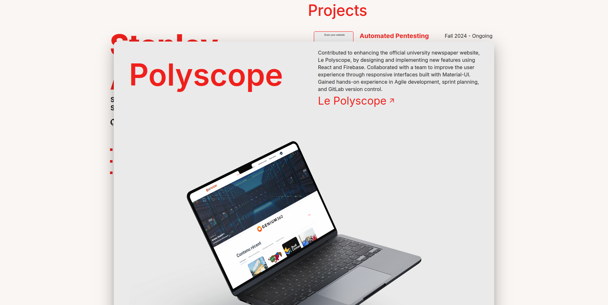

# Stanley Avril - Portfolio Website 🌐

This repository contains the source code for my personal portfolio website. Built using modern web development technologies, this site showcases my professional experience, skills, and projects, providing an interactive and visually appealing platform for visitors.

---

## Features ✨

- **Responsive Design:** Optimized for seamless viewing across desktop, tablet, and mobile devices.
- **Project Showcase:** Highlights my key projects with links to GitHub repositories.
- **About Me Section:** Provides an overview of my background, education, and interests.
- **Contact Form:** Enables easy communication for recruiters or collaborators.
- **Social Links:** Direct access to my GitHub, LinkedIn, and other professional profiles.

---

## Technologies Used 🛠️

- **Frontend:** [React.js](https://reactjs.org/), [Material-UI](https://mui.com/)
- **Styling:** CSS, Material-UI
- **Deployment:** Hosted on GitHub Pages

---

## Screenshots 📸

### Homepage


### Projects Section


---

## Installation and Setup 🚀

1. Clone this repository:
   ```bash
   git clone https://github.com/stanleyavril123/myPortfolio.git
   ```
2. Navigate to the project directory:
  
   cd myPortfolio
   ```bash
   cd myPortfolio
   ```
3. Install dependencies:
   ```bash
   npm instal
   ```
4. Start the development server:
   ```bash
   npm start
   ```
5. Open your browser and navigate to `http://localhost:3000`.

---

## Deployment 🌍

This portfolio is deployed using GitHub Pages. Visit the live version at: [stanleyavril.dev](https://stanleyavril.dev)

To deploy locally:
1. Build the project:
   ```bash
   npm run build
   ```
2. Deploy the `build` folder to GitHub Pages using the following command:
   ```bash
   npm run deploy
   ```

---

## Contributing 🤝

Contributions are welcome! If you find a bug or have a suggestion for improvement, feel free to open an issue or submit a pull request.

---

## License 📜

This project is licensed under the MIT License. See the [LICENSE](LICENSE) file for details.

---

## Contact 📬

Feel free to reach out to me via:
- **Email:** [stanley.avril@outlook.com](mailto:stanley.avril@outlook.com)
- **LinkedIn:** [Stanley Avril](https://linkedin.com/in/stanley-avril)
- **GitHub:** [stanleyavril123](https://github.com/stanleyavril123)
